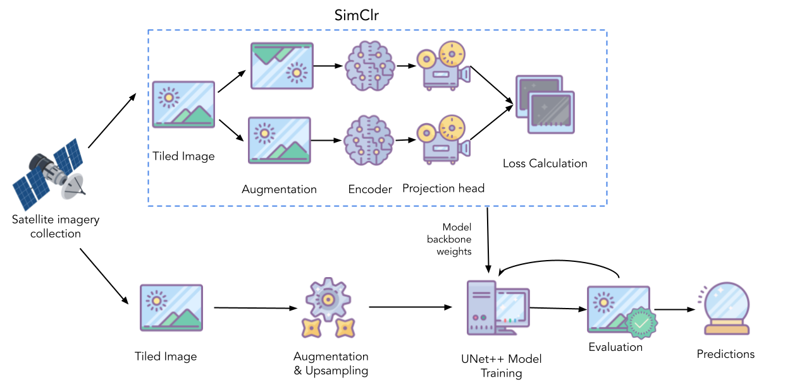
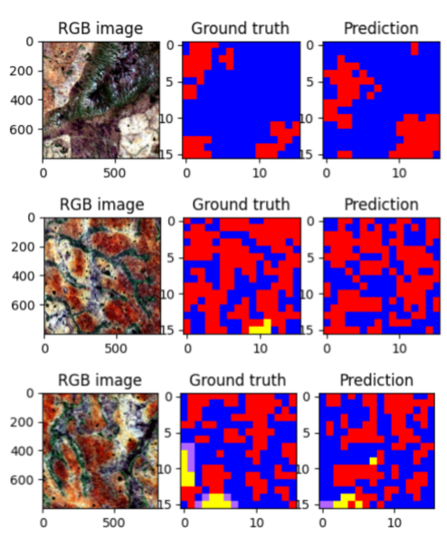
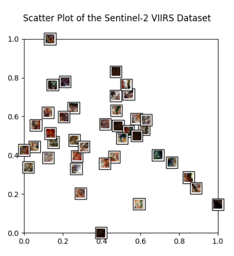
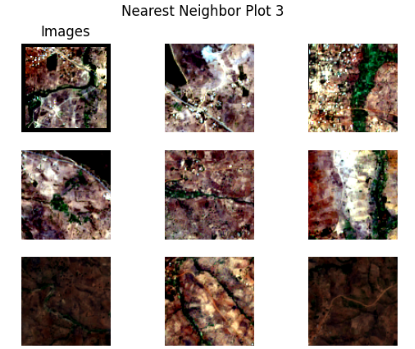
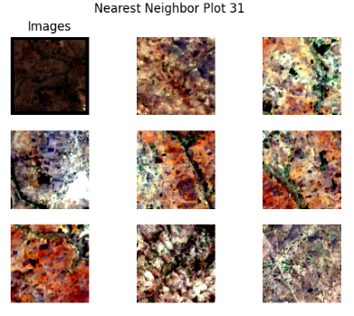

[](https://classroom.github.com/a/6ndC2138)


# CS 175 Final Project 

## Artificial Unintelligence

Group Members: AJ Moon,
Brian Le,
Joshua Cordero,
Noah Risser


## Overview

This project's goal is to use machine learning in order to analyze areas with settlements and/or electricity using Sentinel 2 and VIIRS satellite images. We employ a Self-Supervised Deep Learning model to semantically segment satellite images. We used SimCLR, which is a self-supervised model used to generate our initial weights for our Deep Learning model, U-Net++. This repo contains scripts to run our code, our various models including various supervised models, test cases, and our best model weights trained on these images.

Project documents
[Presentation](https://docs.google.com/presentation/d/1oqYLN1-L_TKw-rn5uoV_nzOL2YuNyasb_uZdeHgEXL4/edit?usp=drive_link)
[Poster](https://docs.google.com/presentation/d/1cKBhTp4_c819uSwylguZbLjDkGQST18T60RmnO3qsj4/edit?usp=drive_link)
[Tech Memo](https://docs.google.com/document/d/18lNjLlPdIC-aW2yqYVh0Pntn_LyG24932s1Ss93IPhM/edit?usp=drive_link)

## Installation
The Code requires `python>3.10` as well `pip` package manager.

Clone the repo

```
git clone git@github.com:cs175cv-s2024/final-project-artificial-unintelligence.git

cd final-project-artificial-unintelligence
```

Create virtual environment and activate it

```
python -m venv env
source ./env/bin/activate
```

Install dependencies
```
pip install -r requirements.txt
```

## Run Commands
Open [utilities.py](./src/utilities.py) and set preferred model.

To train a supervised model run
```
python scripts/supervised/train.py
```
To train a self-supervised model run
```
python scripts/unsupervised/train.py
```

To evaluate these models run
```
python scripts/supervised/evaluate.py --model_path=<path/to/model.cpkt>
```

Pretrained models can be found under the models/ folder.


## ML Pipeline


## SimCLR
SimClr is a self-supervised deep learning architecture that utilizes image augmentations to learn image representations. The primary augmentation used are vertical flip, horizontal flip, and rotation by 90 degrees. The augmentations allow the same unlabeled image to be fed into the backbone encoder twice with their outputs from the projection head to be compared. The goal of this model is to minimize the difference between the output of the same image with augmentations performed on it. 


The weights learned for this model can then be used for the downstream task of image segmentation by attaching a different segmentation head. The decoders available for use with our model are fcn_resnet, deeplabv3, and unet++. 

## U-Net++
U-Net++ is a deep-learning model used for semantic segmentation tasks. It builds upon a U-Net network by adding nested dense skip connections. The model first encodes the images using convolution and pooling layers by reducing the size and increasing the amount of features the model uses to learn.  When decoding and upscaling the images back to their initial resolution, it utilizes nested dense skip connections in order to preserve more spatial information. 


## Sample Results
Below are some sample results. Areas of interest are Human Settlements without electricity which are the red pixels. Our models also classify No Human Settlements without electricity (Blue), Human Settlements with electricity (Yellow), and No Human Settlements with electricity (Purple)



## SimCLR Training
Scatterplot of the outputs of SimCLR encodings



Nearest Neighbor Plots of SimCLR




## Citing Artificial Unintelligence CS 175 Final Project 
```
@misc{Cordero2024Artificial,
  title={Artificial Unintelligence CS 175 Final Project},
  author={Joshua Cordero, Brian Le, AJ Moon, Noah Risser},
  year={2024}
}
```
